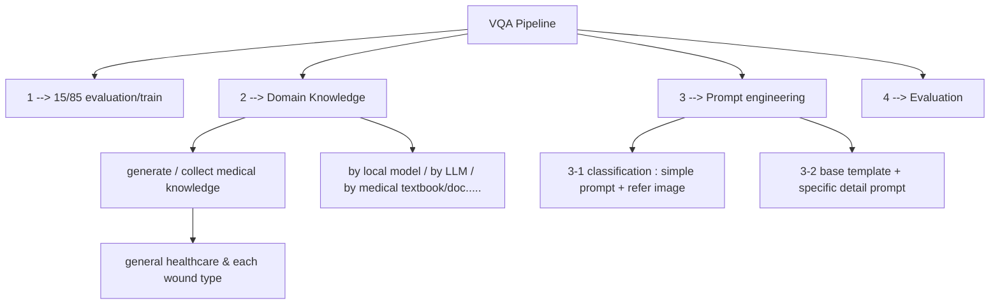

# image-caption VQA

## TOP RARGET : IMAGE_CAPTIONING DATABASE

### target
- build image-caption database base on above mentioned simple condition
- notice : must note that "not from prof doctors"
- for healthcare / second diagnosis recommandation

### restriction
- local model (ollama is good platform) 
- individual user with consumer-level GPU affordable
- each type of wound has 100 or even less images, with only "type" label

### method
- simple one: local ollama, with more focus on prompt-engineering & fine-tune(but how to "fine-tune" local model on ollama??)
- complex one: encoder-decoder VLM on huggingface, fine-tune them,and with some prompt engineering

### cur situation
i have already try the former, but i haven't got satisfied result, 

### have tried
- base_template prompt
- specific prompt for each type of wound

### not complete:
- domain knowledge transfer : local model hasn't got medical-background information of those specific type of wound. So it can only answer in the general way, instead of prof word
    - must find correspind text / image-text data of each type, to build background of local model 
    - Q : how to feed these data to local model? do survey & excerpt from correspond research.
- prompt engineering : have no idea how to improve the prompt
- valuable performance : haven't implement a score, to have a standard of VQA performance
    - recommand validation method
        - 指標名稱    應用場景    衡量重點
        - CIDEr / METEOR    圖片敘述 (Captioning)    與人類描述語氣的相似度與共識。
        - BLEU / ROUGE    文字生成    文本層面的重疊度（雖然目前重要性在降低）。
        - VQA Accuracy    視覺問答    針對封閉式問題（Yes/No 或 選擇題）的答對率。    
    - some conmparison 
        - 特性    BLEU    ROUGE
        - 核心目標    精確率 (Precision)    召回率 (Recall)
        - 擅長領域    機器翻譯 (Translation)    文章摘要 (Summarization)
        - 懲罰對象    懲罰「亂寫」和「太短」    懲罰「漏寫」
        - 常用變體    BLEU-4 (看連續 4 個單詞)    ROUGE-1, ROUGE-2, ROUGE-L
    - another Q : how to use these standartd to iterationally improve local model/prompt-engineering? do survey & excerpt from correspond research.

=======
- 純model不會變的，如果要做data-transfer，那就需要另外調模型出來fine-tune

- 可獲得的醫療資料來源
    - 公開資料集
    - 權威醫療教科書(base for txt)

================================================
# Evalustion

為了量化模型表現，必須建立自動化的評估腳本，將「Vibe」轉化為數據。

## 1. 量化指標 (NLP Metrics)
我們使用以下指標衡量生成描述與專家答案（Ground Truth）的重疊度：

| 指標名稱 | 實作工具 | 衡量重點 |
| :--- | :--- | :--- |
| **CIDEr** | `pycocoevalcap` | 衡量與人類描述的共識度與特徵捕捉。 |
| **BLEU-4** | `nltk.translate` | 檢查關鍵醫學術語的連續字詞重疊度。 |
| **METEOR** | `nltk` | 考慮同義詞後的語義相似度。 |

## 2. 評估流程步進實作
### Step 1: 建立驗證集
從每種類型抽取 15% 影像作為 Test Set，並準備對應的高質量描述。

### Step 2: 自動化腳本
撰寫 Python 腳本調用 Ollama API 取得預測結果，並與驗證集進行比對計算分數。

### Step 3: 人工抽檢 (Expert Check)
針對 10% 的生成結果進行 1-5 分的專業度人工評分：
- **1分**：完全錯誤。
- **3分**：描述正確但用詞不專業。
- **5分**：具備臨床專業參考價值。

## 3. 迭代閉環 (Iteration Loop)
1. 跑分 -> 2. 找出分數最低的案例 -> 3. 修正知識庫或 Prompt -> 4. 重新測試觀察分數升降。

=============================================
# fineTune
## 1. 數據增強 (Data Augmentation)
由於原始資料僅有「Type」標籤，必須先進行「數據提純」以符合 Captioning 需求。

### 1.1 合成標籤 (Synthetic Captioning)
- **作法**：利用 GPT-4o 或 Claude 3.5 對這 100 張圖進行初步醫學打標，生成詳細的 JSON 描述檔。
- **產出**：建立 (Image -> Detailed Text) 的訓練對。

## 2. 模型架構與工具
- **基座模型**：建議選用 HuggingFace 上的 **Moondream2** (1.6B) 或 **LLaVA-v1.6-7B**。
- **訓練工具**：使用 **Unsloth** 或 **LlamaFactory**，這些工具支援 **QLoRA**，能在消費級 GPU 上完成微調。

## 3. 實作流程
1. **轉換格式**：將數據轉為訓練專用的 `jsonl` 格式。
2. **訓練設定**：專注於 Decoder 的微調，讓模型學會醫學語法與描述邏輯。
3. **匯出部署**：訓練完成後，將模型轉換為 GGUF 格式並載入 **Ollama** 執行。

## 4. 關鍵優勢
- 內化領域知識：減少對長 Prompt 的依賴。
- 語氣穩定性：生成的描述會比純 Prompt 方式更具醫療專業感。

============================================
# inference
LLaVA-med

==============================================
# non-fineTune

## 1. 核心邏輯：RAG-for-Vision (視覺檢索增強)
針對本地模型（如 LLaVA 或 Moondream）看不懂專業術語的問題，我們透過「外部知識掛載」的方式，在推理時為模型提供醫學背景知識。

### 1.1 建立領域知識字典 (Prompt Dictionary)
建立一個 JSON 格式的字典，將傷口標籤對應到標準臨床特徵：
- **實作方式**：當輸入標籤為 `ulcer_grade2` 時，自動抓取對應資訊。
- **資訊內容**：定義、特徵（如真皮層暴露、無腐肉）、建議專家用詞。

## 2. 提示工程優化 (Prompt Engineering)
不再使用單一指令，改為「結構化引導」。

### 優化後的 Prompt 結構
> **[醫療參考資訊]**：{definition}。特徵包含：{features}。
>
> **[任務]**：分析此影像，對應上述資訊，描述傷口的邊緣與組織狀態。
>
> **[分析要求]**：
> 1. 識別病灶位置與邊緣狀況（如：紅腫、浸潤）。
> 2. 判定組織組成（如：肉芽組織百分比）。
> 3. **必須**使用專業術語（如：{expert_terminology}）。
>
> **[限制]**：若特徵不符請說明原因。標註「非醫生診斷」。

## 3. 本地模型部署 (Ollama)
- **硬體**：消費級 GPU 即可負擔。
- **推薦模型**：`moondream` (輕量敏捷) 或 `llava:7b-v1.6`。

===============

========================
# more idea
prompt 設計具體一些 要下constraint（請他「不要」做什麼事情

prompt 可以帶 f-string

看不懂的醫療 => 可以先測試 
prompt要下「非醫生診斷」的說明
跑不同類別 要下不同關鍵字 f-format?

deploy的時候要先做 cla? Yes

prompt生成：建立影像描述資料集 當作baseline
可以先不用那麼嚴謹 這邊先求有

需要翻譯成中文嗎？==> if for mannual check
