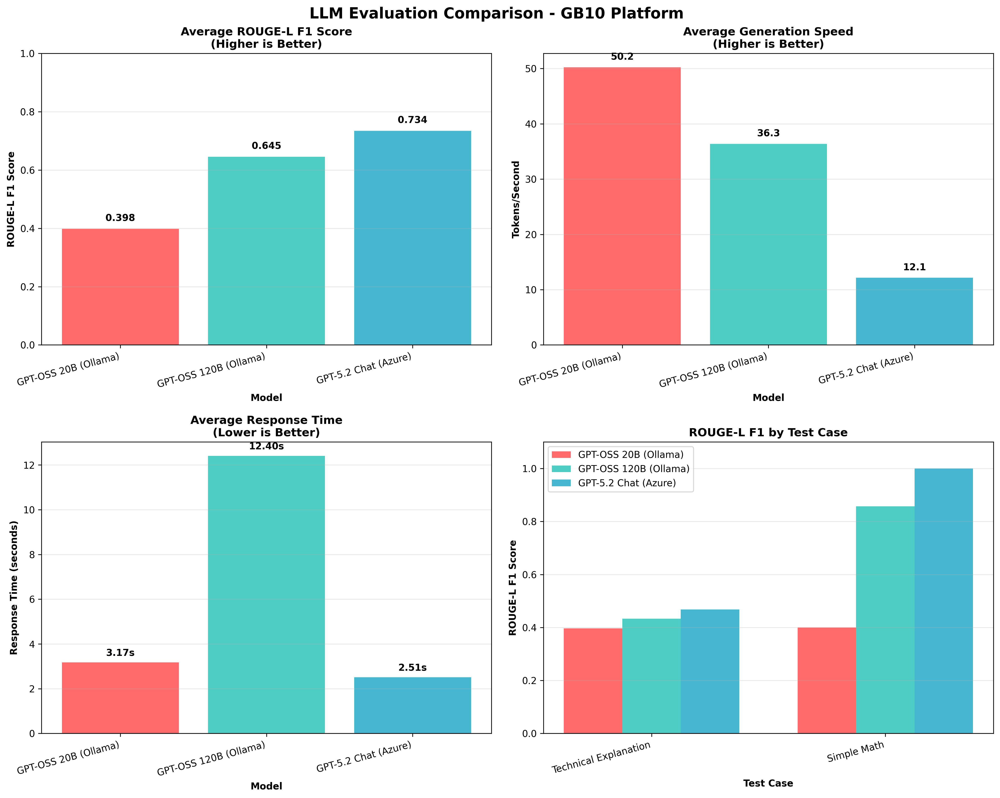
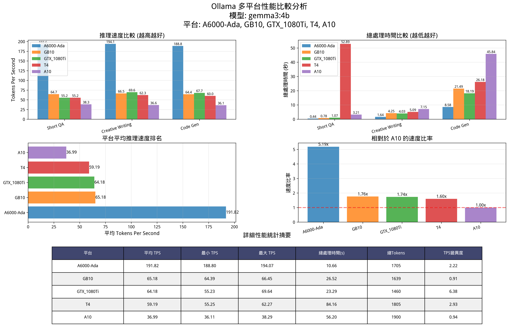

510

> this weeks's progress：complete 10% smoke test of simple/full prompt design, and record properly

### test record rules
> 測試實驗都要做的完整一點
- record the data, and draw with tool like. matplib…. 
- todoList
    - [ ]  basic testing info
    - [ ]  quota(basline generation with Gemini API) consuming
    - [ ]  time consuming
    - [ ]  context window size
    - [ ]  token per seoncd / each model
    - [ ]  model peratmeters + input/output average tokens
    - reference record form (can refer the data in it, and adjust to my proj)
    
    ```json
    
    "timestamp": "2026-01-02T05:46:07.737617",
            "platform(hardware)": "A10",
            "model": "gemma3:4b",
            "test_case": "Creative Writing",
            "metrics": {
                "total_duration_sec": 7.152067647,
                "load_duration_sec": 0.201994783,
                "tokens_per_second": 36.56,
                "eval_count": 248,
                "prompt_eval_count": 25
            }
    ```
    
- ex pic
    - </img>
    - </img>    


### last time problem
- Gemini API exceed the limit in a second, i'm not sure it because call it nultiple time at a very short time-period or what? this week must find the problem/fix it, or do some test locally at first and call API after, **to make sure i can submit Gemini's result this week**


### text data
> since textbook/books usually many unrelated data, it must extract the necessary part/chapter from them, avoid waste context window
- wound text related data(textbook, ) can use RAG to feed model
    - choose retrieval tool
- text data source:
    - NCKU Library's ebook
    - some online resource


### new idea: "skills" - improve my ai's work
> since i almost build this project with ai, i realize that i can import skills to improve it performance.
- some aspect:
    - prompt-engineering
    - agentic evaluation
    - pyhton testing
    - code review
    - review document / readme
- more (need test): since these skills most use for general, build a skill about specific rules of this project 
    - suggest: System Instruction, Always load
- skills source: https://skills.sh/
- skills and git: general skills(3rd-party's skills) not commit(each developer will have it own choice), only upload introduce in docs is fine; specific skills must commit, to make sure sync everywhaere and everytime.
