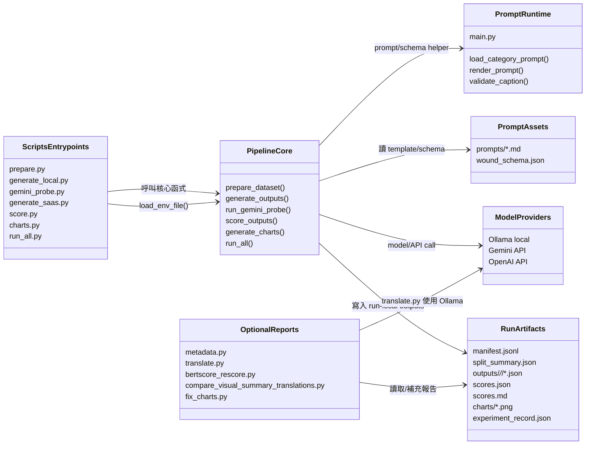
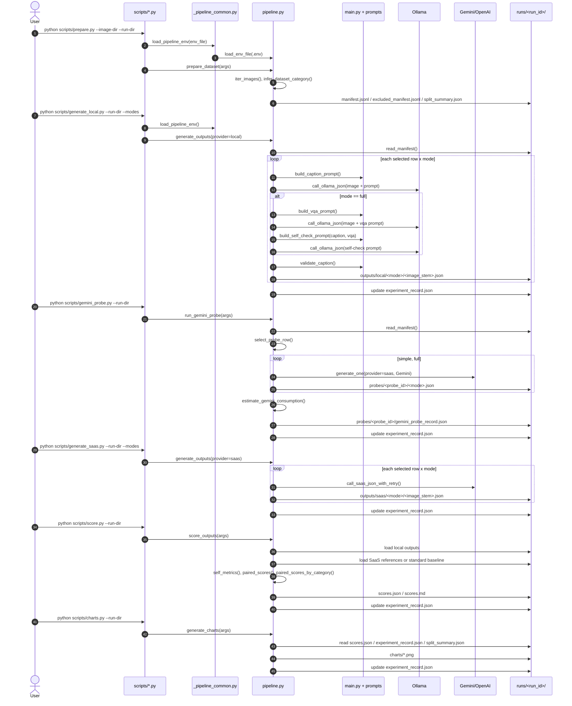

# scripts 目前 Pipeline 詳細說明

本文件依據 `scripts/` 目前的 stage entrypoints 與共用核心 `pipeline.py` 撰寫。`scripts/*.py` 是建議使用的命令入口；大多數腳本只負責解析 CLI 參數、讀取 `.env`，再呼叫 `pipeline.py` 的核心函式。所有 run-specific 產物應留在指定的 `--run-dir` 之下。

## 1. 整體定位

目前 pipeline 是 wound image captioning / VLM prompt evaluation pipeline，不是 training pipeline。它的主要工作是：

1. 掃描影像資料集並建立 manifest / smoke split。
2. 用 local Ollama model 或 SaaS model 產生 caption JSON。
3. 用 SaaS output 當 reference，對 local output 做格式與文字相似度評分。
4. 產生 run-local charts、metadata report、translation output、BERTScore 補充分數。

核心檔案分工如下：

| 檔案 | 角色 | 主要呼叫 |
|---|---|---|
| `scripts/_pipeline_common.py` | 將 repo root 加進 `sys.path`，並載入 `.env` | `load_pipeline_env()` -> `pipeline.load_env_file()` |
| `scripts/prepare.py` | 建立 manifest 與 split summary | `pipeline.prepare_dataset(args)` |
| `scripts/generate_local.py` | 呼叫 local Ollama 產生 output | `pipeline.generate_outputs(namespace(provider="local", ...))` |
| `scripts/gemini_probe.py` | 先用一張圖測 Gemini simple/full 與 quota 估算 | `pipeline.run_gemini_probe(args)` |
| `scripts/generate_saas.py` | 呼叫 Gemini/OpenAI 產生 SaaS reference output | `pipeline.generate_outputs(namespace(provider="saas", ...))` |
| `scripts/score.py` | 讀 local / SaaS outputs 並評分 | `pipeline.score_outputs(args)` |
| `scripts/charts.py` | 根據 scores / record / split 畫圖 | `pipeline.generate_charts(args)` |
| `scripts/run_all.py` | 一次跑 prepare、generate、score、charts | `pipeline.run_all(args)` |
| `scripts/metadata.py` | 將 run metadata 整理成 report table | `build_summary()` |
| `scripts/translate.py` | 用 local Ollama 翻譯 output caption，輸出 mirror JSON | `translate_caption()`、`translated_bundle()` |
| `scripts/bertscore_rescore.py` | 對英文與翻譯資料做 grouped BERTScore | `build_report()`、`score_comparison()` |
| `scripts/compare_visual_summary_translations.py` | 比較不同 run 的翻譯 visual summary | `build_report()` |
| `scripts/fix_charts.py` | 針對既有 run 重畫 chart PNG | `backup_charts()`、`save_bar()` |

## 2. Package Diagram



## 3. Main Sequence Diagram



## 4. Stage-by-stage 詳細流程

### 4.1 prepare.py

Purpose:

- 掃描 `--image-dir` 內的影像。
- 依資料夾或檔名前綴推論 wound category。
- 依 `--smoke-percent` 與 `--seed` 建立 formal/smoke split。
- 不呼叫任何模型。

Input:

| 參數 / 檔案 | 說明 |
|---|---|
| `--image-dir` | 影像資料根目錄 |
| `--run-dir` | 本次 run 的輸出目錄 |
| `--smoke-percent` | smoke subset 比例，預設 10 |
| `--seed` | 分層抽樣用 random seed |
| `--exclude-dirs` | 掃描時排除的資料夾名稱，預設 `MM-SkinQA` |
| `--env-file` | 預設 repo `.env`，此 stage 通常不需要 API key |

Call flow:

1. `scripts.prepare.main()`
2. `parse_args()`
3. `load_pipeline_env(args.env_file)`
4. `pipeline.prepare_dataset(args)`
5. `iter_images(image_dir, exclude_dirs)`
6. `infer_dataset_category(image, image_dir)`
7. `is_supported_category(category)`
8. `write_manifest(run_dir, rows)`
9. `write_jsonl(excluded_manifest.jsonl, excluded_rows)`
10. `write_json(split_summary.json, summary)`

Output:

| 檔案 | 內容 |
|---|---|
| `<run-dir>/manifest.jsonl` | 每張支援類別影像一列，包含 `image`、`image_name`、`category`、`scopes` |
| `<run-dir>/excluded_manifest.jsonl` | 不支援 category 或被排除的影像紀錄 |
| `<run-dir>/split_summary.json` | split 統計、category count、seed、smoke percent、exclude dirs |

`manifest.jsonl` 的每列大致長這樣：

```json
{
  "image": "images/<category>/<file>.jpg",
  "image_name": "<file>.jpg",
  "category": "<normalized_category>",
  "scopes": ["formal", "smoke"]
}
```

### 4.2 generate_local.py

Purpose:

- 使用 local Ollama model 產生 caption output。
- `simple` mode 只做 caption prompt。
- `full` mode 做 caption、VQA、自我檢查三段 prompt。
- 記錄 token、prefill/decode time、GPU/VRAM runtime metadata。

Input:

| 參數 / 檔案 | 說明 |
|---|---|
| `--run-dir` | 必須已包含 `manifest.jsonl` |
| `--scopes` | 選取 `smoke`、`formal` 或 comma-separated scopes，預設 `smoke` |
| `--modes` | `simple`、`full` 或 `simple,full`，預設兩者都跑 |
| `--local-model` | Ollama model name，預設 `gemma4:26b` |
| `--workers` | ThreadPoolExecutor worker 數 |
| `--limit` | 限制選取筆數，0 表示不限 |

Call flow:

1. `scripts.generate_local.main()`
2. 包裝 `argparse.Namespace(provider="local", ...)`
3. `pipeline.generate_outputs(args)`
4. `read_manifest(run_dir)`
5. `scope_arg(args.scopes)`、解析 `args.modes`
6. 建立 jobs: selected rows x modes
7. 每個 job 呼叫 `generate_one(row, provider="local", model, mode, ...)`
8. `build_caption_prompt(category, mode)`
9. `call_ollama_json(model, prompt, image_path, local_usage)`
10. 若 `mode == "full"`，再呼叫 `build_vqa_prompt()`、`build_self_check_prompt()` 與兩次 `call_ollama_json()`
11. `validate_caption(caption)`
12. `write_json(output_path(...), result)`
13. `update_experiment_record(run_dir, generation stats)`

Output:

| 檔案 | 內容 |
|---|---|
| `<run-dir>/outputs/local/simple/*.json` | local simple caption bundle |
| `<run-dir>/outputs/local/full/*.json` | local full caption/VQA/self-check bundle |
| `<run-dir>/experiment_record.json` | generation stats、token、duration、GPU/VRAM metadata |

單一 output bundle 結構：

```json
{
  "metadata": {
    "image": "...",
    "image_name": "...",
    "scopes": ["formal", "smoke"],
    "raw_category": "...",
    "target_category": "...",
    "provider": "local",
    "model": "gemma4:26b",
    "mode": "simple",
    "total_duration_sec": 0.0,
    "input_token_count": 0,
    "output_token_count": 0
  },
  "caption": {},
  "auxiliary_vqa": null,
  "self_check": null,
  "schema_validation": {
    "pass": true,
    "errors": []
  }
}
```

### 4.3 gemini_probe.py

Purpose:

- 在大量 SaaS generation 前，先選一張圖跑 Gemini simple/full。
- 估算 request count、token count、RPM/RPD/TPM 壓力、retry/quota 風險。
- 只針對 Gemini；不支援 OpenAI probe。

Input:

| 參數 / 檔案 | 說明 |
|---|---|
| `--run-dir` | 必須已包含 `manifest.jsonl` |
| `--scopes` | probe 候選 scope，預設 `smoke` |
| `--seed` | 隨機選一張 probe image |
| `--limit` | 可限制估算的 selected count |
| `--saas-model` | Gemini model，預設 `pipeline.DEFAULT_GEMINI_MODEL` |
| `--saas-request-delay-sec` | 每次 API call 前 sleep 秒數 |
| `--saas-max-retries` | retry 次數 |
| `--saas-backoff-base-sec` | exponential backoff 基準秒數 |

Call flow:

1. `scripts.gemini_probe.main()`
2. `pipeline.run_gemini_probe(args)`
3. `read_manifest(run_dir)`
4. `scope_arg(args.scopes)`
5. `select_probe_row(rows, scopes, seed)`
6. 對 `MODES = ("simple", "full")` 逐一執行：
   - `empty_generation_stats("saas", args.saas_model, "gemini")`
   - `generate_one(provider="saas", saas_provider="gemini", mode=...)`
   - `call_saas_json_with_retry()`
   - `call_gemini_json()`
   - `write_json(probes/<probe_id>/<mode>.json, result)`
7. `estimate_gemini_consumption(probe_results, selected_count, model)`
8. `write_json(gemini_probe_record.json, probe_record)`
9. `update_experiment_record(run_dir, {"gemini_probe": ...})`

Output:

| 檔案 | 內容 |
|---|---|
| `<run-dir>/probes/<probe_id>/simple.json` | 單張圖 simple Gemini output |
| `<run-dir>/probes/<probe_id>/full.json` | 單張圖 full Gemini output |
| `<run-dir>/probes/<probe_id>/gemini_probe_record.json` | quota/token/request 預估 |
| `<run-dir>/experiment_record.json` | probe 紀錄 |

### 4.4 generate_saas.py

Purpose:

- 使用 SaaS provider 產生 reference output。
- 支援 `--saas-provider gemini` 或 `openai`。
- Gemini 會記錄 usageMetadata token；OpenAI call 目前主要解析 JSON response。
- 具 retry、request delay、quota/rate limit/network error 統計。

Input:

| 參數 / 檔案 | 說明 |
|---|---|
| `--run-dir` | 必須已包含 `manifest.jsonl` |
| `--scopes` | 預設 `smoke` |
| `--modes` | 預設 `simple` |
| `--saas-provider` | `gemini` 或 `openai` |
| `--saas-model` | SaaS model name |
| `--workers` | worker 數 |
| `--limit` | 限制筆數 |
| `--saas-request-delay-sec` | API call 前 sleep |
| `--saas-max-retries` | retry 次數 |
| `--saas-backoff-base-sec` | backoff 秒數 |
| `.env` | Gemini 需要 `GEMINI_API_KEY`；OpenAI 需要 `OPENAI_API_KEY` |

Call flow:

1. `scripts.generate_saas.main()`
2. 包裝 `argparse.Namespace(provider="saas", ...)`
3. `pipeline.generate_outputs(args)`
4. `generate_one(provider="saas", model=args.saas_model, saas_provider=args.saas_provider)`
5. `call_saas_json_with_retry()`
6. `call_saas_json()`
7. 依 provider 分流：
   - Gemini: `call_gemini_json()` -> `https://generativelanguage.googleapis.com/...`
   - OpenAI: `call_openai_json()` -> `https://api.openai.com/v1/responses`
8. `validate_caption()`
9. `write_json(outputs/saas/<mode>/<image_stem>.json, result)`
10. `update_experiment_record()`

Output:

| 檔案 | 內容 |
|---|---|
| `<run-dir>/outputs/saas/simple/*.json` | SaaS simple reference bundle |
| `<run-dir>/outputs/saas/full/*.json` | SaaS full reference bundle，若有跑 full |
| `<run-dir>/experiment_record.json` | SaaS request/retry/quota/token/error 統計 |

### 4.5 score.py

Purpose:

- 對 local output 做 schema/self metrics。
- 以 SaaS same-mode output 當 reference 計算 local simple/full scores。
- simple reference 預設優先使用標準 baseline `runs/saas_simple_baseline`；若不存在才用 `<run-dir>/outputs/saas/simple`。
- 分數屬 exploratory，`baseline_quality_gate.manual_review_result` 預設仍是 pending。

Input:

| 參數 / 檔案 | 說明 |
|---|---|
| `--run-dir` | 必須包含 outputs |
| `--reference-mode` | baseline quality gate 使用的 reference mode，script 預設 `simple` |
| `--score-scopes` | 評分 scope，預設 `smoke` |
| `--saas-simple-baseline-dir` | simple reference baseline，預設 `runs/saas_simple_baseline` |

Call flow:

1. `scripts.score.main()`
2. `pipeline.score_outputs(args)`
3. `scope_arg(args.score_scopes)`
4. 決定 simple reference source：
   - 若 `saas_simple_baseline_dir.exists()`，使用 standard baseline。
   - 否則使用 `<run-dir>/outputs/saas/simple`。
5. `load_bundles_from_dir(simple_reference_dir, score_scopes)`
6. `load_bundles(run_dir, "saas", "full", score_scopes)`
7. 對 provider/mode 執行：
   - `self_metrics(bundle_list)`
   - local provider 額外執行 `paired_scores(candidate, reference)`
   - local provider 額外執行 `paired_scores_by_category()`
8. 建立 `evaluation_comparisons`
9. `baseline_quality_gate()`
10. `write_json(scores.json, scores)`
11. `write_scores_md(run_dir, scores)`
12. `update_experiment_record()`

Output:

| 檔案 | 內容 |
|---|---|
| `<run-dir>/scores.json` | 完整 score object、cells、comparisons、warnings |
| `<run-dir>/scores.md` | Markdown summary table |
| `<run-dir>/experiment_record.json` | scores、score_summary、quality gate |

主要 metric：

| 類型 | 函式 | 說明 |
|---|---|---|
| schema valid rate | `self_metrics()` | `schema_validation.pass` 比例 |
| required field completion | `completion_rate()` | caption 必填欄位完成度 |
| not-observed usage | `not_observed_usage()` | 未觀察到資訊是否用規範語句 |
| no-ruler compliance | `no_ruler_compliance()` | 是否避免無尺規尺寸推測 |
| safety scope | `safety_scope_compliance()` | 是否維持 visual-description-only |
| BLEU-4 | `bleu4()` | local caption text vs SaaS reference |
| ROUGE-L | `rouge_l()` | local caption text vs SaaS reference |
| METEOR-lite | `meteor_lite()` | local caption text vs SaaS reference |
| CIDEr-lite | `cider_lite()` | local caption text vs SaaS reference |

### 4.6 charts.py

Purpose:

- 讀取 run-local scores、experiment record、split summary。
- 產生 PNG chart。
- 不呼叫模型。

Input:

| 參數 / 檔案 | 說明 |
|---|---|
| `--run-dir` | 必須包含 `scores.json`、`experiment_record.json`、`split_summary.json` |

Call flow:

1. `scripts.charts.main()`
2. `pipeline.generate_charts(args)`
3. `read_optional_json(run_dir / "scores.json")`
4. `read_optional_json(experiment_record_path(run_dir))`
5. `load_split_summary(run_dir)`
6. `write_bar_chart()` 多次輸出 PNG
7. `update_experiment_record(run_dir, {"charts": ...})`

Output:

| 檔案 | 說明 |
|---|---|
| `<run-dir>/charts/json_valid_rate.png` | 各 provider/mode JSON valid rate |
| `<run-dir>/charts/score_comparison_table.png` | simple/full BLEU/CIDEr 摘要 |
| `<run-dir>/charts/category_counts.png` | category count |
| `<run-dir>/charts/matched_image_count.png` | matched/unmatched count |
| `<run-dir>/charts/saas_api_errors.png` | SaaS API error/retry |
| `<run-dir>/charts/same_mode_local_score_delta.png` | full - simple delta |
| `<run-dir>/charts/score_by_category.png` | category-wise CIDEr-lite |
| `<run-dir>/charts/latency_by_provider_mode.png` | provider/mode latency |
| `<run-dir>/charts/tokens_per_second_local.png` | local token speed placeholder |
| `<run-dir>/experiment_record.json` | chart file list |

### 4.7 run_all.py

Purpose:

- 一次跑標準 pipeline：prepare -> local/SaaS generate -> score -> charts。
- 可用 `--parallel-providers` 讓 local 與 SaaS generation 同時跑。
- 可用 `--stop-before-score` 在 generation 後停止，方便人工檢查 output。

Call flow:

1. `scripts.run_all.main()`
2. `pipeline.run_all(args)`
3. `prepare_dataset(args)`
4. `generate_both(args)`
5. 若 `--stop-before-score`：停止。
6. `score_outputs(args)`
7. `generate_charts(args)`

`generate_both()` 會建立兩個 generate args：

| Provider | scopes 來源 | 呼叫 |
|---|---|---|
| local | `--local-scopes` | `generate_outputs(provider="local")` |
| saas | `--saas-scopes` | `generate_outputs(provider="saas")` |

## 5. Output JSON 的核心資料結構

### 5.1 `experiment_record.json`

此檔是 run 的累積紀錄，由多個 stage 逐步 merge 更新。

常見 top-level keys：

| key | 來源 stage | 說明 |
|---|---|---|
| `run_metadata` | generate / score | dataset、scope、platform、GPU/RAM、metric definitions |
| `generation.local` | generate local | local output count、schema count、token、duration、GPU usage |
| `generation.saas` | generate SaaS | request、retry、quota、token、duration |
| `gemini_probe` | gemini probe | probe id、selection、quota prediction |
| `scores` | score | 完整 scores object |
| `score_summary` | score | report-ready score rows |
| `evaluation_comparisons` | score | local vs SaaS comparison |
| `baseline_quality_gate` | score | reference baseline 品質門檻 |
| `charts` | charts | chart 產出檔名 |

### 5.2 prompt mode 差異

| mode | prompt call count | 內容 |
|---|---:|---|
| `simple` | 1 | `build_caption_prompt()` -> caption JSON |
| `full` | 3 | caption prompt + VQA prompt + self-check prompt |

`full` 的 output 會多出：

- `auxiliary_vqa`
- `self_check`

但 scoring 主要仍從 `caption` 欄位抽文字做比較。

## 6. Optional / report scripts

### 6.1 metadata.py

Purpose:

- 把 `split_summary.json`、`experiment_record.json`、`scores.json` 與 outputs 整理成 report-ready Markdown table。
- 不呼叫模型。
- 輸出必須在 `--run-dir` 內，程式用 `ensure_under_run_dir()` 檢查。

Input:

| 參數 / 檔案 | 說明 |
|---|---|
| `--run-dir` | 讀取 run-local artifacts |
| `--output` | 預設 `<run-dir>/<run-name>_record_summary.md` |

Call flow:

1. `parse_args()`
2. `build_summary(run_dir)`
3. `read_json(split_summary.json)`
4. `read_json(experiment_record.json)`
5. `read_json(scores.json)`
6. `build_metadata_rows()`
7. 寫出 Markdown。

Output:

- `<run-dir>/<run-name>_record_summary.md` 或指定的 run-local output path。

### 6.2 translate.py

Purpose:

- 用 local Ollama model 將每個 output bundle 的 `caption` 翻譯成繁中。
- 保留原始 JSON keys 與 nested structure。
- 原始 `<run-dir>/outputs/` 不會被修改。
- 翻譯只供 human review，不用於原本 `score.py` scoring。

Input:

| 參數 / 檔案 | 說明 |
|---|---|
| `--run-dir` | 讀取 `<run-dir>/outputs/*/*/*.json` |
| `--model` | 翻譯用 local Ollama model，預設 `gemma4:26b` |

Call flow:

1. `output_json_paths(run_dir)`
2. 對每個 source output：
   - `translated_path(run_dir, source_path)`
   - `read_json(source_path)`
   - `translate_caption(model, caption)`
   - `ollama.chat(format="json")`
   - `translated_bundle(...)`
   - `write_json(output_path, bundle)`
3. `write_translation_summary(run_dir, translated_paths)`

Output:

| 檔案 | 說明 |
|---|---|
| `<run-dir>/output_translation/<provider>/<mode>/*.json` | mirror translated output |
| `<run-dir>/output_translation/<run-name>_translation_summary.md` | 翻譯 token/duration/GPU summary |

### 6.3 bertscore_rescore.py

Purpose:

- 對英文 reference/candidate 與翻譯 reference/candidate 做 grouped semantic comparison。
- 需要 `bert_score` 套件。
- 輸出是補充分析，不取代原本 `pipeline.py score`。

四組資料來源：

| ID | 預設來源 | 意義 |
|---|---|---|
| `a_reference_english` | `--reference-dir`，預設 `runs/saas_simple_baseline` | 英文 SaaS reference |
| `b_translated_reference` | `<run-dir>/output_translation/saas/<mode>` 或自動找 overlap | 翻譯後 reference |
| `c_candidate_english` | `<run-dir>/outputs/<provider>/<mode>` | 英文 local candidate |
| `d_translated_candidate` | `<run-dir>/output_translation/<provider>/<mode>` 或自動找 overlap | 翻譯後 candidate |

Comparison groups:

| group | comparison | 說明 |
|---|---|---|
| caption quality | `a_vs_c` | local English caption vs SaaS English reference |
| translation faithfulness | `a_vs_b` | translated reference vs original English reference |
| translation faithfulness | `c_vs_d` | translated candidate vs original English candidate |
| human review calibration | `a_vs_d` | translated candidate vs English reference |
| human review calibration | `b_vs_d` | translated candidate vs translated reference |

Output:

| 檔案 | 說明 |
|---|---|
| `<run-dir>/bertscore_comparisons.json` | 完整 grouped BERTScore 結果 |
| `<run-dir>/bertscore_comparisons.md` | Markdown summary、category table、highest/lowest examples |

### 6.4 compare_visual_summary_translations.py

Purpose:

- 比較不同 run 的 translated `caption.image_observation.visual_summary`。
- 預設比較 `runs/510_smoke_v1`、`runs/523_smoke_v2` 與 510 的 SaaS simple。
- 依 category 隨機抽樣，產生 human review Markdown。

Input:

| 參數 | 說明 |
|---|---|
| `--run-510` | 預設 `runs/510_smoke_v1` |
| `--run-523` | 預設 `runs/523_smoke_v2` |
| `--per-type` | 每個 category 抽幾張 |
| `--seed` | 抽樣 seed |
| `--output` | 預設 `runs/visual_summary_translation_comparison.md`，必須在 `runs/` 內 |

Output:

- `runs/visual_summary_translation_comparison.md`

### 6.5 fix_charts.py

Purpose:

- 針對既有 run 重畫 chart PNG，並先備份舊 PNG。
- 預設 run 是 `runs/510_smoke_v1`。
- 這是修圖輔助腳本，不是主 pipeline 必跑 stage。

Output:

| 檔案 / 目錄 | 說明 |
|---|---|
| `<run-dir>/charts/_backup_before_523_fix/` | 原 chart 備份 |
| `<run-dir>/charts/*.png` | 重畫後 chart |

## 7. Error / retry / validation 行為

### 7.1 SaaS retry

`call_saas_json_with_retry()` 會在每次 request 前依 `request_delay_sec` sleep，並統計：

- `request_count`
- `api_success_count`
- `api_failure_count`
- `retry_count`
- `rate_limit_errors`
- `quota_errors`
- `network_errors`

可 retry 條件包含：

- `httpx.TimeoutException`
- `httpx.NetworkError`
- HTTP status `408, 409, 425, 429, 500, 502, 503, 504`
- 文字中包含 rate limit / quota / 429 / resource exhausted

### 7.2 JSON parsing

模型回應都要求 JSON，但程式仍提供 fallback：

- `parse_json_text()` 先直接 `json.loads(text)`。
- 如果失敗，會抓第一段 `{ ... }` 再解析。
- Gemini 若沒有 text content，會丟出包含 finish reason / prompt feedback / response snippet 的錯誤。

### 7.3 Schema validation

`validate_caption()` 會使用 `wound_schema.json` 與 `main.py` 的 `validate_caption()`。每個 output bundle 會保存：

```json
{
  "schema_validation": {
    "pass": true,
    "errors": []
  }
}
```

Scoring 的 `schema_valid_rate` 就是 output bundle 中 `schema_validation.pass` 的比例。

## 8. 建議標準執行順序

```bash
python scripts/prepare.py \
  --image-dir images \
  --run-dir runs/<YYYYMMDD>_<model> \
  --smoke-percent 10 \
  --exclude-dirs MM-SkinQA \
  --seed 42

python scripts/generate_local.py \
  --run-dir runs/<YYYYMMDD>_<model> \
  --scopes smoke \
  --modes simple,full \
  --local-model gemma4:26b \
  --workers 1

python scripts/gemini_probe.py \
  --run-dir runs/<YYYYMMDD>_<model> \
  --scopes smoke \
  --seed 42 \
  --saas-model gemini-2.5-flash \
  --saas-request-delay-sec 4 \
  --saas-max-retries 5 \
  --saas-backoff-base-sec 5

python scripts/generate_saas.py \
  --run-dir runs/<YYYYMMDD>_<model> \
  --scopes smoke \
  --modes simple \
  --saas-provider gemini \
  --saas-model gemini-2.5-flash \
  --workers 1 \
  --saas-request-delay-sec 4 \
  --saas-max-retries 5 \
  --saas-backoff-base-sec 5

python scripts/score.py \
  --run-dir runs/<YYYYMMDD>_<model> \
  --reference-mode simple \
  --score-scopes smoke

python scripts/charts.py \
  --run-dir runs/<YYYYMMDD>_<model>
```

若要一鍵跑主流程：

```bash
python scripts/run_all.py \
  --image-dir images \
  --run-dir runs/<YYYYMMDD>_<model> \
  --smoke-percent 10 \
  --seed 42 \
  --exclude-dirs MM-SkinQA \
  --local-scopes smoke \
  --saas-scopes smoke \
  --modes simple,full \
  --local-model gemma4:26b \
  --saas-provider gemini \
  --saas-model gemini-2.5-flash \
  --workers 1 \
  --reference-mode simple \
  --score-scopes smoke
```

## 9. 目前 pipeline 的重要限制

1. `scripts/` 是 preferred entrypoints，但真正 implementation 仍集中在 `pipeline.py`。
2. `score.py` 的 simple reference 會優先使用 `runs/saas_simple_baseline`；因此新 run 即使沒有重新產生 SaaS simple，也可能可做 simple scoring。
3. `full` scoring 需要 `<run-dir>/outputs/saas/full`；若沒有 SaaS full reference，`local_full_vs_saas_full` 會出現 zero matched images。
4. `baseline_quality_gate.manual_review_result` 預設是 `pending`，所以分數定位是 exploratory。
5. `translate.py` 的輸出只供 human review；原本 `score.py` 不讀 `output_translation/`。
6. `bertscore_rescore.py` 是補充分數，需要額外 dependency，不是主 pipeline 必跑 stage。
7. 所有 run-specific results 應在 `--run-dir` 或 `runs/` 之下，避免把實驗結果寫進 `docs/`。
