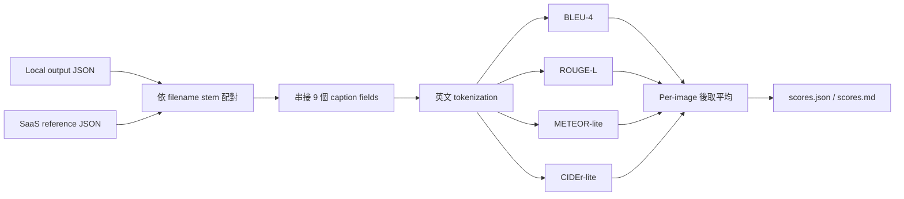
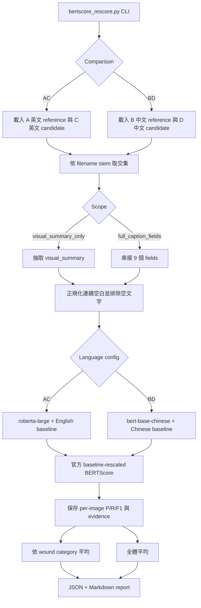
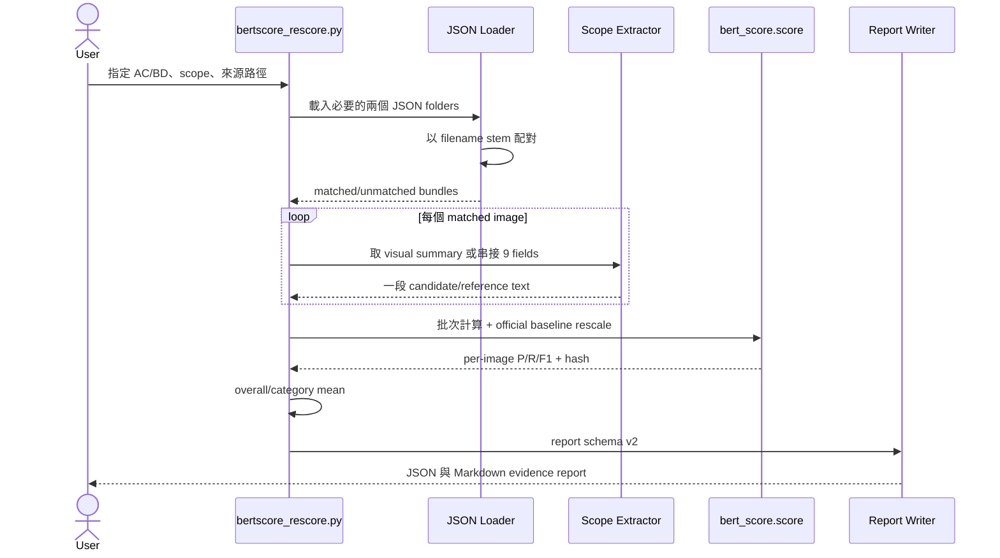
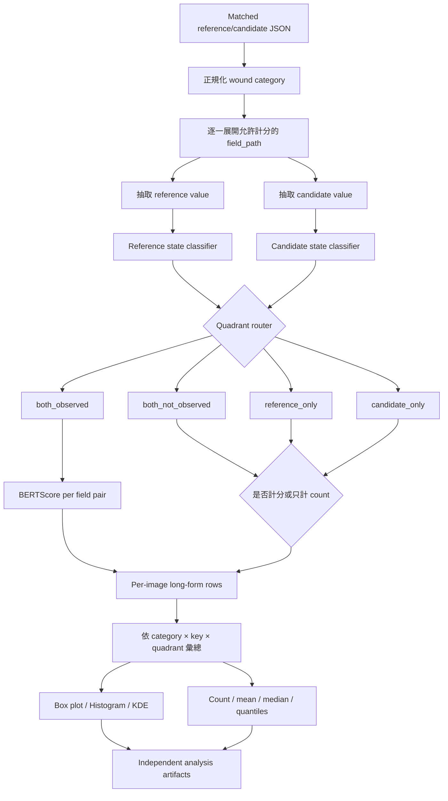
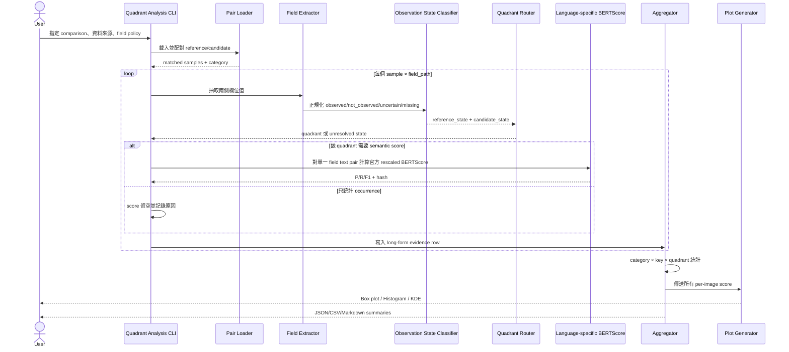

# BERTScore 四象限分析 Pipeline 與 Sequence Diagram

本文件用於說明目前 score pipeline 的實際行為、會議規劃與現況落差，以及預計的「傷口類型 × JSON key × 四象限」分析流程。本文只定義流程與待決需求，不代表四象限功能已實作。

## 1. 分析範圍

相關程式：

```text
pipeline.py
scripts/score.py
scripts/bertscore_rescore.py
scripts/translate.py
wound_schema.json
```

目前有兩條互相獨立的評分路徑：

| 路徑 | 指標 | 主要用途 |
|---|---|---|
| Lexical score | BLEU-4、ROUGE-L、METEOR-lite、CIDEr-lite | 比較 local 與 SaaS 的字詞及 n-gram 重疊 |
| BERTScore | 官方 language-specific baseline-rescaled P/R/F1 | 比較 local 與 SaaS 的 embedding semantic similarity |

## 2. 現行 Lexical Score Pipeline

`scripts/score.py` 是 CLI wrapper，實際呼叫 `pipeline.score_outputs()`。

每張圖片的 candidate/reference 先透過 `caption_text()` 串接以下欄位：

```text
caption.image_observation.visual_summary
caption.wound_features.shape_pattern
caption.wound_features.edges_margins
caption.wound_features.wound_bed
caption.wound_features.color
caption.wound_features.texture
caption.wound_features.fluid_exudate_bleeding
caption.wound_features.periwound_skin
caption.category_specific_check.observed_supporting_features
```

串接後才計算四個 lexical metrics。最後將每張圖片的結果做全體平均及 category 平均。



目前 lexical score 不會產生 per-key 分數，也不會辨識 observed/not-observed 狀態。

## 3. 現行 BERTScore Pipeline

### 3.1 Comparison

目前只保留兩種 comparison：

| ID | Reference | Candidate | 語言 / Upstream model |
|---|---|---|---|
| AC | SaaS 英文 caption | Local 英文 caption | `en` / `roberta-large` |
| BD | SaaS caption 中文翻譯 | Local caption 中文翻譯 | `zh` / `bert-base-chinese` |

每次 command 只能選擇一個 comparison 與一個 scope。

### 3.2 Scope

`visual_summary_only` 只取 `visual_summary`。

`full_caption_fields` 使用與 lexical score 相同的 9 個欄位，但目前做法是：

```text
9 個欄位先串成單一字串
→ 每張圖片計算一次 BERTScore
→ 對 per-image score 取全體及 category 平均
```

目前不是：

```text
每個 key 分別計算 BERTScore
→ 再對 key score 取平均
```

這是會議描述與現行實作最主要的落差，也正是目前無法定位低分 key 的原因。

### 3.3 Rescale

程式直接呼叫 upstream `bert_score.score()`，固定使用：

```python
rescale_with_baseline=True
return_hash=True
```

官方 rescale 由 package 依 language、model、layer 的 baseline 執行：

```text
rescaled_score = (raw_score - baseline) / (1 - baseline)
```

專案不再使用 `(raw + 1) / 2`。

### 3.4 Current-state Pipeline Diagram



### 3.5 Current-state Sequence Diagram



## 4. 現況限制與需求落差

### 4.1 無法定位個別 key

`full_caption_fields` 將不同性質的欄位串接後只產生一個 per-image score。因此無法回答：

- 哪個 key 造成低分。
- 低分來自用詞不同，還是 observed/not-observed 結論相反。
- 固定的 `not observed` 是否使某些 key 虛高。
- 某類傷口的特定 key 是否特別不穩定。

### 4.2 Observation state 沒有統一契約

Schema 中只有以下兩個欄位有明確 enum：

```text
wound_features.foreign_material_debris
wound_features.necrosis_eschar
```

其值為：

```text
observed | not observed | uncertain
```

其他 wound feature 是自由文字，可能使用：

```text
not observed
none visible
absent
uncertain
cannot determine
具體的 positive 描述
```

因此四象限分析前，必須先定義如何把每個 key 的自由文字轉為 observation state。

### 4.3 `uncertain` 與 missing 無法直接放入 2×2

四象限假設每個模型只有 observed/not-observed 兩種狀態，但現有 schema 明確允許 `uncertain`，實際資料也可能缺值或空字串。若直接把它們歸入 not-observed，會混淆「確定沒看到」與「無法判斷」。

### 4.4 Translation usage 契約矛盾

`scripts/translate.py` 的規則與 summary 仍寫著翻譯內容只供 human review、不參與 scoring；但目前 BD 已正式對翻譯資料計算 BERTScore。需求確認後應統一這項文件與 metadata 契約。

### 4.5 配對識別仍使用 filename stem

Lexical score 與 BERTScore 都以 filename stem 配對。同名圖片可能覆寫或錯配；未來 per-key/per-quadrant 分析會放大此風險，正式實作前應確認資料集是否保證 stem 唯一，或改用穩定 `sample_id`。

## 5. Proposed 四象限分析資料模型

建議最小分析單位為一筆 long-form row：

```text
sample_id
image_name
wound_category
comparison
scope
field_path
reference_text
candidate_text
reference_state
candidate_state
quadrant
bertscore_precision
bertscore_recall
bertscore_f1
bertscore_hash
```

核心維度：

```text
wound category × field_path × quadrant × image
```

預期七類傷口應先正規化為固定 canonical labels：

```text
abrasion
bruise
burn
cut
ingrown_nail
laceration
stab_wound
```

## 6. Proposed 四象限 Pipeline

在純二元 state 定義下，四象限為：

| Reference/Gemini | Candidate/Local | Quadrant | 主要解讀 |
|---|---|---|---|
| observed | observed | both_observed | 比較正向描述的語意與用詞 |
| not_observed | not_observed | both_not_observed | 一致否定，但資訊量低，獨立報告 |
| observed | not_observed | reference_only | Local 可能漏檢，或 Gemini 過度判讀 |
| not_observed | observed | candidate_only | Local 可能誤判/幻覺，或 Gemini 漏檢 |



## 7. Proposed Sequence Diagram



## 8. 建議輸出

建議四象限分析使用獨立目錄，不覆蓋既有 BERTScore report：

```text
runs/bertscore_quadrant_reports/<report-id>/
├── evidence.jsonl
├── summary.json
├── summary.md
└── plots/
    ├── by_category/
    ├── by_field/
    └── by_quadrant/
```

最低必要統計：

```text
sample_count
scored_count
quadrant_count
quadrant_rate
mean
median
standard_deviation
min/max
p25/p75
```

圖表應直接使用 `evidence.jsonl` 的 per-image score，不可只根據平均值重建。

## 9. 實作前待決需求

依賴順序如下：

1. 定義 `uncertain`、missing、空字串的處理方式。
2. 定義哪些 field_path 參與 observation-state 與四象限分析。
3. 定義自由文字轉 observation state 的規則及人工覆核方式。
4. 定義四個 quadrant 中哪些需要計算 BERTScore，哪些只統計 count/rate。
5. 確認四象限主分析只做 AC，還是 AC 與 BD 都做。
6. 確認 sample identifier 是否需先從 filename stem 改成穩定 `sample_id`。
7. 定義圖表最小樣本數及 KDE 在小樣本下的 fallback。
8. 定義正式輸出的版本、命名與舊 report 相容政策。

以上決策確認前，不應直接實作 state classifier 或四象限 scorer，否則容易把不確定狀態硬塞進錯誤象限。
